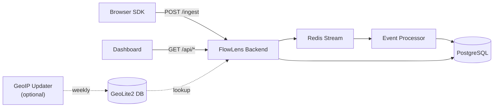

# FlowLens

**Open-source, self-hosted web monitoring.** FlowLens captures errors, Web Vitals, and API performance from your frontend applications and surfaces them in a real-time dashboard — on your own infrastructure, with no data leaving your servers.

```sh
npm install @mxrxwin/flowlens-sdk
```

```ts
import { initMonitoring } from '@mxrxwin/flowlens-sdk';

initMonitoring({ dsn: 'https://your-instance/ingest?project_key=pk_live' });
```

That's all your application needs to do.

---

## Features

- **Error tracking** — uncaught exceptions and unhandled rejections with stack trace, affected endpoint, and the last two user interactions that preceded the error.
- **Performance monitoring** — Largest Contentful Paint, First Input Delay, Time to First Byte, and per-endpoint API latency, broken down by route and region.
- **Correlation detection** — recurring error patterns are automatically grouped by message, endpoint, region, device type, and browser so incidents become visible without writing SQL.
- **Server-side GeoIP** — region is resolved on the backend from a local MaxMind database. No external API calls on the ingest path.
- **Project isolation** — multiple applications can report to one FlowLens instance using separate project keys.
- **Dashboard password protection** — optional HTTP Basic Auth on the dashboard. The ingest endpoint stays open for SDKs regardless.
- **Fully self-hosted** — one `docker compose up` and everything runs: backend, dashboard, PostgreSQL, Redis.

---

## Architecture



Events flow from the browser SDK to the `/ingest` endpoint, through an internal queue, and into PostgreSQL. The dashboard reads from the same database through a REST API. Everything runs in a single Docker Compose stack.

---

## Quick start

```sh
git clone https://github.com/Mxrxwin/FlowLens.git
cd FlowLens
cp .env.example .env
```

Edit `.env`:

- Set `POSTGRES_PASSWORD` to a strong password.
- Set `FLOWLENS_PROJECT_KEYS` to a comma-separated list of project keys your applications will use (e.g. `pk_myapp`).
- Optionally set `FLOWLENS_DASHBOARD_PASSWORD` to protect the dashboard.

```sh
docker compose up -d --build
```

The dashboard is now available at **http://localhost:5173**.

---

## Connecting your application

Install the SDK:

```sh
npm install @mxrxwin/flowlens-sdk
```

Add one line to your application entry point:

```ts
import { initMonitoring } from '@mxrxwin/flowlens-sdk';

initMonitoring({
  dsn: 'https://your-instance/ingest?project_key=pk_myapp',
});
```

To also capture API latency and network errors, pass your axios instance:

```ts
import axios from 'axios';
import { initMonitoring } from '@mxrxwin/flowlens-sdk';

initMonitoring({
  dsn: 'https://your-instance/ingest?project_key=pk_myapp',
  axios,
});
```

To report errors from `try/catch` blocks:

```ts
import { reportError } from '@mxrxwin/flowlens-sdk';

try {
  await processPayment();
} catch (e) {
  reportError({ message: e.message, stack: e.stack, endpoint: '/api/payment' });
}
```

No changes are required on your backend. See the [SDK documentation](https://www.npmjs.com/package/@mxrxwin/flowlens-sdk) for the full API reference.

---

## Environment variables

| Variable | Required | Default | Description |
|---|---|---|---|
| `POSTGRES_USER` | yes | `user` | PostgreSQL user. |
| `POSTGRES_PASSWORD` | yes | `password` | PostgreSQL password. **Change before deploying.** |
| `POSTGRES_DB` | yes | `monitoring` | Database name. |
| `DATABASE_URL` | yes | — | Full PostgreSQL connection URL. Must match the credentials above. |
| `REDIS_ADDR` | yes | `redis:6379` | Redis address. |
| `FLOWLENS_PROJECT_KEYS` | yes | `pk_demo` | Comma-separated list of valid project keys accepted by `/ingest`. |
| `FLOWLENS_HTTP_PORT` | no | `5173` | Host port for the dashboard. |
| `FLOWLENS_DASHBOARD_PASSWORD` | no | _(empty — no auth)_ | Enables HTTP Basic Auth on the dashboard. |
| `FLOWLENS_DASHBOARD_USER` | no | `admin` | Username for dashboard auth. |
| `FLOWLENS_GEOIP_ENABLED` | no | `false` | Enables server-side GeoIP enrichment. |
| `FLOWLENS_GEOIP_DB_PATH` | no | `/geoip/GeoLite2-City.mmdb` | Path to the MaxMind database file. |
| `FLOWLENS_STORE_IP` | no | `false` | Persist client IP addresses. Disabled by default for privacy. |
| `MAXMIND_ACCOUNT_ID` | no | — | MaxMind account ID for the optional GeoIP updater. |
| `MAXMIND_LICENSE_KEY` | no | — | MaxMind license key for the optional GeoIP updater. |

---

## Project keys and DSN

A project key is a **public identifier** — not a secret. It routes events to the correct project and is safe to include in your frontend bundle. The DSN is the ingest URL with the key embedded:

```
https://your-instance/ingest?project_key=pk_myapp
```

For production deployments, use long randomly-generated keys. If a key is compromised, add a new one, redeploy the SDK, then remove the old key — no restart required.

---

## GeoIP enrichment

FlowLens resolves the region for each event server-side using the following priority:

1. Region hint provided by the browser SDK (from the device timezone).
2. Geo headers from CDN or reverse proxy (Cloudflare, Vercel, AWS CloudFront).
3. Local MaxMind GeoLite2-City database lookup by client IP.
4. Fallback: `"Unresolved region"`.

No external API is called on the ingest path. GeoIP is entirely optional.

### Enabling MaxMind

Sign up for a free GeoLite2 account at [maxmind.com](https://www.maxmind.com/en/geolite2/signup), then add to `.env`:

```env
FLOWLENS_GEOIP_ENABLED=true
MAXMIND_ACCOUNT_ID=your_account_id
MAXMIND_LICENSE_KEY=your_license_key
```

Download the database and start FlowLens:

```sh
docker compose --profile geoip run --rm geoip-updater
docker compose up -d
```

Keep the database up to date with a background updater (refreshes weekly):

```sh
docker compose --profile geoip up -d geoip-updater
```

---

## Security and privacy

- **Project keys are public identifiers.** They are not authentication tokens. Anyone with a key can submit events to that project — this is the same model as Sentry's public DSN.
- **Use HTTPS in production.** Deploy FlowLens behind a TLS-terminating reverse proxy. The bundled server does not handle TLS directly.
- **Client IPs are not stored by default.** Set `FLOWLENS_STORE_IP=true` to opt in. The ingest endpoint never trusts a client-supplied IP.
- **Dashboard access.** Set `FLOWLENS_DASHBOARD_PASSWORD` to enable HTTP Basic Auth. For production, consider placing the dashboard behind a VPN or corporate SSO proxy.
- **Change default credentials.** The example values in `.env.example` are for local development only.

---

## Troubleshooting

**Dashboard shows a blank page or stale content.**
Force a hard refresh (`Cmd/Ctrl+Shift+R`). If the issue persists after a deployment, restart the frontend container: `docker compose restart frontend`.

**`/ingest` returns `401 invalid project key`.**
The key your SDK is sending is not in `FLOWLENS_PROJECT_KEYS`. Verify the DSN and restart the backend after updating `.env`.

**All events show `Unresolved region`.**
GeoIP is either disabled or the database file is not present. Enable it in `.env` and run the GeoIP updater. If GeoIP is not needed, this is the expected fallback for traffic without CDN geo headers.

**Events are not appearing on the dashboard.**
Check that the SDK DSN points to the correct host, that `/ingest` returns `200`, and that the backend container is healthy (`docker compose ps`). Backend logs are available via `docker compose logs -f backend`.

---

## Self-hosting in production

For a production deployment:

1. Change `POSTGRES_PASSWORD` and update `DATABASE_URL` to match.
2. Replace `pk_demo` in `FLOWLENS_PROJECT_KEYS` with a randomly-generated key.
3. Set `FLOWLENS_DASHBOARD_PASSWORD`.
4. Place FlowLens behind a reverse proxy with HTTPS and a real domain.

The repository includes a `Makefile` with an SSH/rsync-based deployment helper. See `Makefile` for available targets.

---

## Documentation

- [Event contract](docs/event_contract.md) — full JSON schema for all event types.
- [GeoIP setup](docs/geoip.md) — detailed MaxMind configuration and operational notes.
- [SDK reference](https://www.npmjs.com/package/@mxrxwin/flowlens-sdk) — full API documentation for `@mxrxwin/flowlens-sdk`.
